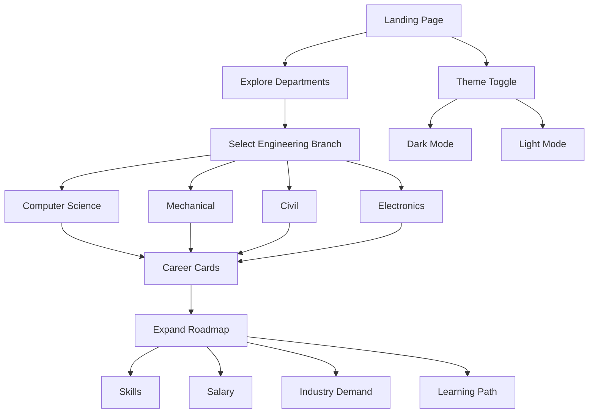

# 🚀 B.TECH FUTURESCAPE

<p align="center">


</p>

<p align="center">

### **The Ultimate Career Guidance Platform for Engineering Students**

Discover career opportunities, salary insights, industry demand, and complete learning roadmaps across multiple engineering branches with an immersive futuristic UI.

---

## 🌟 Overview

**B.TECH FUTURESCAPE** is a modern career exploration platform built for engineering students who want to understand future career opportunities before graduation.

The platform provides:

* 📚 Structured Learning Roadmaps
* 💰 Salary Insights
* 📈 Industry Demand
* 🎯 Career Guidance
* 🚀 Technology Trends
* 🌙 Beautiful Dark & Light Themes
* ✨ Premium Glassmorphism UI

Whether you're from **Computer Science, Mechanical, Civil, or Electronics Engineering**, the platform helps students discover the best career paths with visually engaging interactive roadmaps.

---

# ✨ Features

## 🎨 Premium UI

* Modern Glassmorphism Design
* Beautiful Gradient Backgrounds
* Animated Floating Blobs
* Responsive Layout
* Dark / Light Theme
* Smooth Scroll Experience

---

## 🚀 Career Guidance

✔ Frontend Development

✔ Backend Development

✔ Full Stack Development

✔ AI / ML

✔ DevOps

✔ Cyber Security

✔ Data Science

✔ Cloud Computing

✔ VLSI

✔ Embedded Systems

✔ CAD Design

✔ Site Engineering

✔ Structural Engineering

and many more...

---

## 📊 What Students Get

* Career Overview
* Skills Required
* Average Salary
* Industry Demand
* Step-by-Step Roadmap
* Learning Resources
* Future Scope

---

# 🏗 Project Architecture

```text
                    User
                      │
                      ▼
             React + TypeScript
                      │
        ┌─────────────┼─────────────┐
        │             │             │
        ▼             ▼             ▼
     Home Page     Streams      Theme Manager
        │             │
        │             ▼
        │      Branch Selection
        │             │
        ▼             ▼
     Career Cards ─────────► Expand Roadmaps
                              │
                              ▼
                     Salary + Skills + Demand
```

---

# 🔄 Application Flow



---

# 🛠 Tech Stack

| Technology       | Purpose         |
| ---------------- | --------------- |
| React 18         | UI Development  |
| TypeScript       | Type Safety     |
| Vite             | Fast Build Tool |
| TailwindCSS      | Styling         |
| Framer Motion    | Animations      |
| React Router DOM | Routing         |
| Lucide React     | Icons           |

---

# 📂 Project Structure

```text
src
│
├── components
│   ├── CareerCard
│   ├── Footer
│   ├── FloatingBlobs
│   ├── GlassCard
│   └── ThemeToggle
│
├── pages
│   ├── Home
│   ├── Streams
│   ├── CSIT
│   ├── Mechanical
│   ├── Civil
│   └── Electronics
│
├── assets
│
├── styles
│
└── App.tsx
```

---

# 📸 Screenshots

> Replace these images with your project screenshots.

```md


```

---

# 🚀 Getting Started

## Clone Repository

```bash
git clone https://github.com/Mausam-Kumari9534/B.TECH-FUTURESCAPE.git
```

```bash
cd B.TECH-FUTURESCAPE
```

---

## Install Dependencies

```bash
npm install
```

---

## Run Development Server

```bash
npm run dev
```

Visit

```
http://localhost:8082
```

---

## Production Build

```bash
npm run build
```

---

# 🎯 Future Improvements

* AI Career Recommendation
* Resume Analyzer
* Resume Builder
* Mock Interview
* Company-wise Roadmaps
* Placement Preparation
* Internship Finder
* Coding Roadmaps
* Skill Assessment Quiz
* Personalized Dashboard

---

# 🤝 Contributing

Contributions are welcome.

1. Fork Repository

2. Create Feature Branch

```bash
git checkout -b feature-name
```

3. Commit Changes

```bash
git commit -m "Added new feature"
```

4. Push Branch

```bash
git push origin feature-name
```

5. Open Pull Request

---

# 📜 License

This project is licensed under the **MIT License**.

---

# 👩‍💻 Developer

### **Mausam Kumari**

B.Tech Information Technology Student

Passionate about

* Full Stack Development
* UI/UX
* Modern Web Technologies
* Career Guidance Platforms

GitHub

**https://github.com/Mausam-Kumari9534**

---

<p align="center">

⭐ If you found this project helpful, don't forget to **Star** the repository!

Made with ❤️ using React + TypeScript + TailwindCSS

</p>
